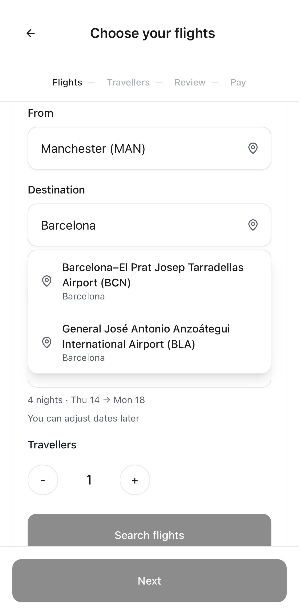
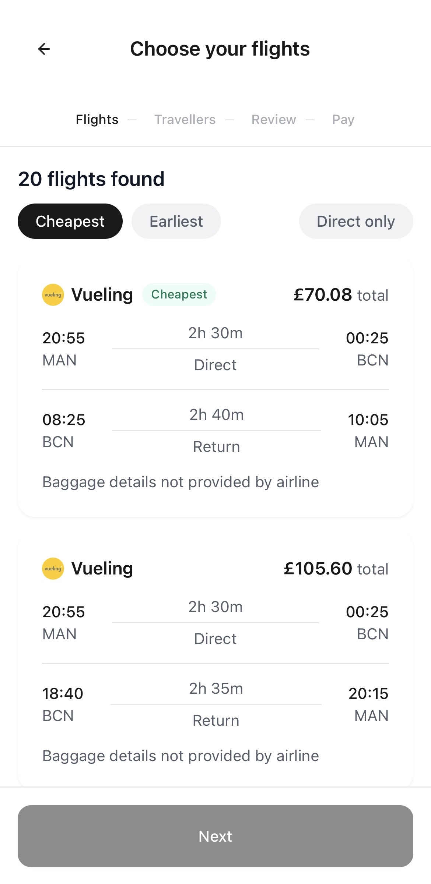
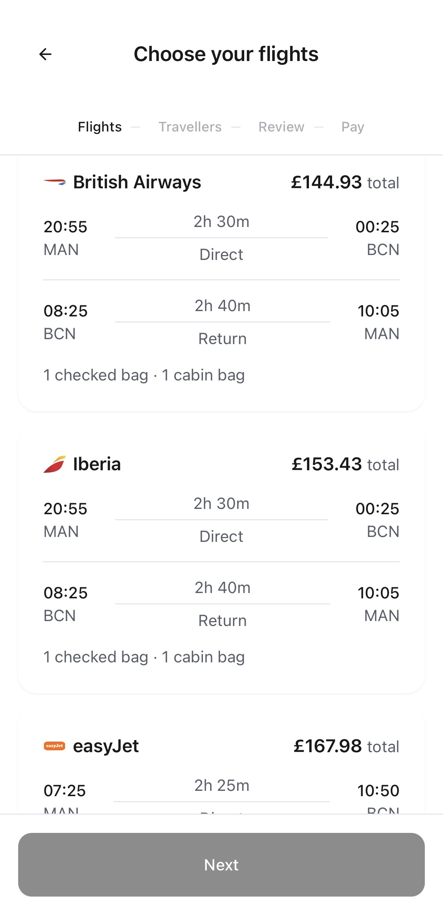
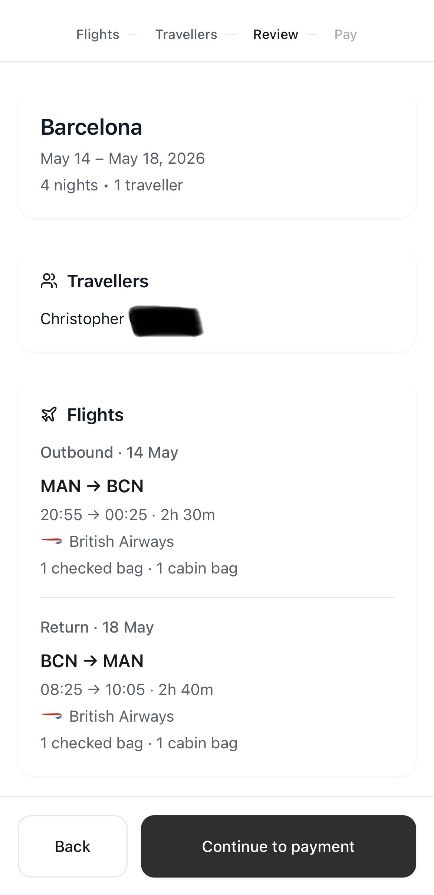
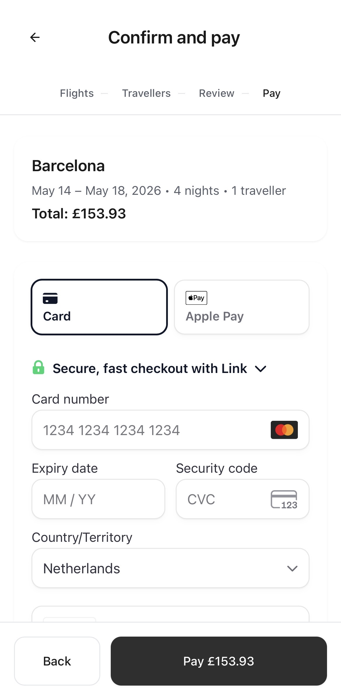
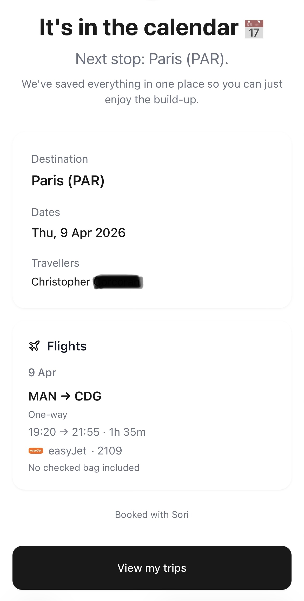
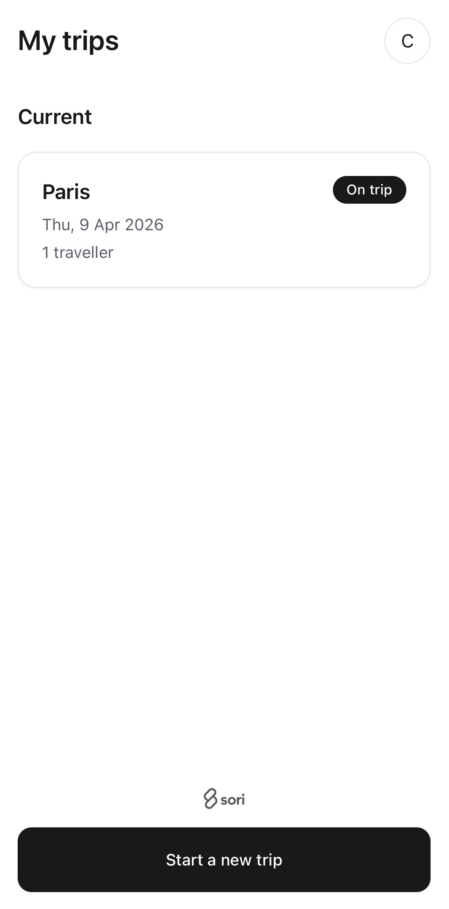

# Sori — Flight Booking Platform

Sori is a live flight booking platform designed to make booking as simple as ordering an Uber.

Live product: https://getsori.com

---

## Overview

Sori is a mobile-first flight booking system focused on speed, simplicity, and reliability.

- Search flights instantly  
- Save traveller details for fast repeat bookings  
- Book flights in ~30 seconds once details are saved  
- Streamlined, low-friction booking flow  

---

## System Capabilities

This is a fully working system handling real-world booking flows:

- Live flight search and offer selection (Duffel API)  
- End-to-end booking flow (search → select → pay → confirmation)  
- Stripe PaymentIntent integration (Payment Element)  
- Webhook-driven booking orchestration (Stripe → backend → Duffel order creation)  
- Webhook-triggered confirmation flow with transactional email delivery (Resend)  
- Persistent trip and traveller data across sessions  

---

## Technical Highlights

- Maintains data integrity across multiple systems (Duffel, Stripe, database)  
- Uses Duffel offer totals as the single source of truth to prevent pricing mismatches  
- Handles real-world edge cases:  
  - Expired or invalid flight offers  
  - Price changes between search and payment  
  - Payment failures and retry logic  
  - Passenger identity mapping between systems  
- Implements strict traveller validation (age rules, required fields, contact data)  
- Uses webhook events (`payment_intent.succeeded`) to trigger downstream booking logic  
- Ensures booking confirmation and email delivery only occur after successful payment and order creation  
- Designed mobile-first with persistent traveller profiles to reduce repeat booking friction  

---

## Booking Flow

1. Search flights (Duffel)  
2. Select offer  
3. Create PaymentIntent (Stripe)  
4. Confirm payment on frontend  
5. Stripe webhook (`payment_intent.succeeded`) triggers backend  
6. Backend validates data and creates Duffel order  
7. Confirmation email sent to user (Resend)  

---

## Screenshots

End-to-end booking flow using live flight data and real payments.

---

### 1. Search

  

---

### 2. Results (Filters & Sorting)

  

---

### 3. Results (Flight Options)

  

---

### 4. Travellers

  

---

### 5. Review

  

---

### 6. Payment

  

---

### 7. Confirmation (Real Booking)

  

---

### 8. Email Confirmation

  

---

### 9. Trips (Upcoming)

  

---

### 10. Trips (On Trip)

  

---

### 11. Trips (Countdown State)

  

---

## Architecture

- Frontend: React, TypeScript, Vite  
- Backend: Supabase (database, auth, edge functions)  
- Payments: Stripe  
- Flight data and booking: Duffel API  
- Email: Resend  

---

## Notes

This repository is intended to demonstrate real-world system design and implementation.

Sensitive credentials and production configuration have been removed.
